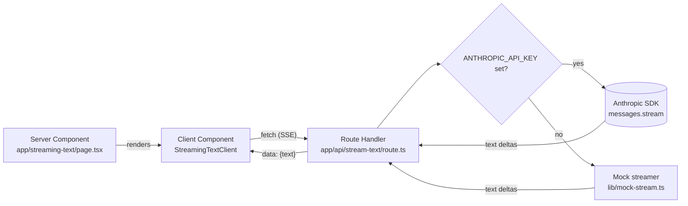

# nextjs-streaming-ai-patterns
> Reference patterns for AI features in Next.js 15 + React 19: streaming text, tool-use UI, partial JSON parsing, optimistic updates with rollback, mid-stream recovery. Each pattern ships with a live demo and the actual source side-by-side.


## What this is

A working Next.js 15 app that demonstrates how to wire up the streaming
patterns AI features actually need in production. One page per pattern,
each page showing the live demo and the actual code that powers it
(read from disk at request time so the displayed source can't drift
from what runs).

The repo is opinionated about two things. First, every pattern is
demoable on a fresh clone *without* an Anthropic API key — when
`ANTHROPIC_API_KEY` is unset, the page falls back to a committed
deterministic mock streamer, and surfaces in the UI which mode is
active (D-003). Second, the displayed source code is the real source
file, read from disk by a Server Component at request time (D-004),
so what you see is exactly what runs — no copy-paste-and-rot.

This PR (issue #1) ships the foundation: **streaming text**. A Next 15
route handler streams Anthropic's text deltas as Server-Sent Events; a
small Client Component reads the stream via the Fetch API's
`ReadableStream` and progressively renders. No WebSockets, no polling.
Subsequent issues (#2 tool-use UI, plus partial-JSON / optimistic /
error-recovery to be filed) build on the same primitives.

## Architecture

See [`docs/architecture.md`](docs/architecture.md) for the patterns
catalog and the request flow. Quick diagram:



## Quickstart

```bash
npm install
cp .env.example .env.local
# Optional: set ANTHROPIC_API_KEY to switch the demo to live mode.
npm run dev                        # → http://localhost:3000
```

Without `ANTHROPIC_API_KEY` the demo runs against the committed mock
streamer with realistic per-token jitter — useful for development and
for code review.

Production build + tests + lint:

```bash
npm run typecheck
npm run lint
npm test                           # 7 hermetic tests on the mock streamer
npm run build
```

## Patterns

| Pattern                                     | Status   | Demo path             | Issue |
|---------------------------------------------|----------|-----------------------|-------|
| Streaming text                              | shipped  | `/streaming-text`     | #1    |
| Tool-use UI with interruption               | pending  | `/tool-use`           | #2    |
| Partial JSON parsing                        | pending  | `/partial-json`       | (tbd) |
| Optimistic updates with rollback            | pending  | `/optimistic-rollback`| (tbd) |
| Error recovery mid-stream                   | pending  | `/error-recovery`     | (tbd) |

## Benchmarks / Results

Not the right metric for this repo. Quality bar is "the pattern is
honest, the source matches the demo, and the no-key fallback works."

## Demo

60-second demo pending until at least three patterns ship — a single
streaming-text demo isn't enough to show *patterns*, it shows *one
pattern*. After #2 lands, the demo loops through three patterns in 60s.

## Why these decisions

See [`MEMORY/core_decisions_human.md`](MEMORY/core_decisions_human.md).
Notable:

- **D-002.** One Next.js app at repo root, one page per pattern under
  `app/<slug>/`. No per-pattern subpackages.
- **D-003.** Every demo page must run without `ANTHROPIC_API_KEY`.
  Mock fallback is mandatory; mode is surfaced in the UI.
- **D-004.** Source displayed alongside each demo is the actual source
  file, read from disk by a Server Component at request time.

## License

MIT
