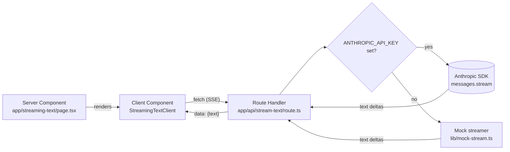

# nextjs-streaming-ai-patterns
> Reference patterns for AI features in Next.js 15 + React 19: streaming text, tool-use UI, partial JSON parsing, optimistic updates with rollback, mid-stream recovery. Each pattern ships with a live demo and the actual source side-by-side.


## What this is

A working Next.js 15 app that demonstrates the streaming patterns AI
features actually need in production. One page per pattern; each page
renders the live demo and the actual source code that powers it,
side-by-side, read from disk at request time so the displayed source
can't drift from what runs.

The repo is opinionated about two things. First, every pattern is
demoable on a fresh clone *without* an Anthropic API key — when
`ANTHROPIC_API_KEY` is unset, the page falls back to a committed
deterministic mock streamer and surfaces in the UI which mode is
active (D-003). Second, the displayed source code is the real source
file, read from disk by a Server Component at request time (D-004),
so what you see is exactly what runs — no copy-paste-and-rot.

Five patterns ship today. The contract that ties them together is one
SSE transport (D-005, D-006): every route handler emits the same
`data: {kind, ...}` envelope, every client tags events by `kind` and
dispatches in one place. AbortController propagates end-to-end (D-007),
so interruption is a browser primitive all the way down.

- **Streaming text** (#1) — a route handler streams Anthropic's text
  deltas as SSE; the client reads via `ReadableStream` and progressively
  renders. The simplest end-to-end shape; the foundation everything else
  builds on.
- **Tool-use UI with interruption** (#2) — the same SSE envelope with
  additional `tool_use_*` event kinds. The client renders the tool call,
  the streaming JSON arguments, the result, and the resumed reasoning. A
  visible Interrupt button calls `abort()` on the fetch and produces a
  clean transcript with a `message_stop: interrupted` terminator.
- **Partial JSON parsing** (#3) — progressive rendering of a structured
  response as the model emits it. A dep-free in-repo state machine (D-008)
  tolerates open strings, open arrays/objects, trailing commas, and
  mid-token primitives, and exposes a `committedAny` flag so UI fields
  fade in as their slot first contains a value.
- **Optimistic updates with rollback** (#4) — React 19 `useOptimistic` +
  a deterministic 50/50 decision oracle keyed by `(id, click_count)` on
  the server (D-010). Successes commit; failures roll back with a
  rendered reason and a border-flash animation. The rollback path is
  reproducible by construction, so the UX is testable, not aspirational.
- **Error recovery mid-stream** (#5) — checkpoint protocol layered over
  SSE. The route handler emits a `kind: "checkpoint"` event every few
  tokens; the client records the most recent checkpoint; on a deliberate
  drop the client reconnects with `?since=N` and accumulating text never
  resets. Checkpoints are token-position integers (D-011), so the server
  has no per-session state and the drop point is deterministic.

The homepage (`/`) is the index — five cards, one per pattern, each
linking to its page. The same `PATTERNS` array drives the cards and is
the source of truth for the Patterns table in this README (see
`test/readme-patterns-table.test.ts` for the snapshot that locks them
together).

## Architecture

See [`docs/architecture.md`](docs/architecture.md) for the patterns
catalog and the request flow. Quick diagram:



## Quickstart

```bash
npm install
cp .env.example .env.local
# Optional: set ANTHROPIC_API_KEY to switch the demo to live mode.
npm run dev                        # → http://localhost:3000
```

Without `ANTHROPIC_API_KEY` the demo runs against the committed mock
streamer with realistic per-token jitter — useful for development and
for code review.

Production build + tests + lint:

```bash
npm run typecheck
npm run lint
npm test                           # hermetic vitest suite (no Anthropic API key)
npm run build
```

## Patterns

| Pattern                                     | Status   | Demo path             | Issue |
|---------------------------------------------|----------|-----------------------|-------|
| Streaming text                              | shipped  | `/streaming-text`     | #1    |
| Tool-use UI with interruption               | shipped  | `/tool-use`           | #2    |
| Partial JSON parsing                        | shipped  | `/partial-json`       | #3    |
| Optimistic updates with rollback            | shipped  | `/optimistic-rollback`| #4    |
| Error recovery mid-stream                   | shipped  | `/error-recovery`     | #5    |

The same five rows live in `app/page.tsx`'s `PATTERNS` array;
`test/readme-patterns-table.test.ts` asserts the table here matches that
array row-for-row (title, slug, status, issue number) and that every
`page.tsx` file the table references exists on disk. The table can't
drift silently.

## Benchmarks / Results

Not the right metric for this repo. Quality bar is "the pattern is
honest, the source matches the demo, and the no-key fallback works."

## Demo

```bash
npm run dev                       # in one terminal
npx playwright install chromium   # once
npm run capture                   # records ~60s of video under docs/
```

`scripts/capture_demo.ts` ([#12], D-012) is a Playwright-driven
deterministic tour of the homepage and the five pattern pages. The
tour's `TIMELINE` constant is the source of truth for what each
recording covers: homepage → `/streaming-text` → `/tool-use`
(with a mid-stream Interrupt click) → `/partial-json` →
`/optimistic-rollback` (two clicks on the first item — the second
hits the deterministic 50/50 oracle D-010 and triggers the rollback
animation) → `/error-recovery` (the route handler always drops the
first request, so the auto-resume pill is guaranteed). The mode pill
in every page header makes the no-key mock mode (D-003) visible in
the recording. `test/capture-demo-smoke.test.ts` runs in CI and
asserts the tour's slugs match `app/page.tsx`'s `PATTERNS` array
and that every referenced `page.tsx` exists on disk, so the capture
can't link to a 404'd pattern.

The actual binary commit (`docs/demo.{webm,mp4,gif}` + README embed)
is split into [#16] — that's a "run the script once, optimize the
output, commit it" step gated on Playwright browsers being installed
locally and on ffmpeg for size/format optimization. Re-record any
time a pattern UX changes; the script is hermetic and the output is
reproducible.

[#12]: https://github.com/jt-mchorse/nextjs-streaming-ai-patterns/issues/12
[#16]: https://github.com/jt-mchorse/nextjs-streaming-ai-patterns/issues/16

## Why these decisions

See [`MEMORY/core_decisions_human.md`](MEMORY/core_decisions_human.md).
Notable:

- **D-002.** One Next.js app at repo root, one page per pattern under
  `app/<slug>/`. No per-pattern subpackages.
- **D-003.** Every demo page must run without `ANTHROPIC_API_KEY`.
  Mock fallback is mandatory; mode is surfaced in the UI.
- **D-004.** Source displayed alongside each demo is the actual source
  file, read from disk by a Server Component at request time.

## License

MIT
