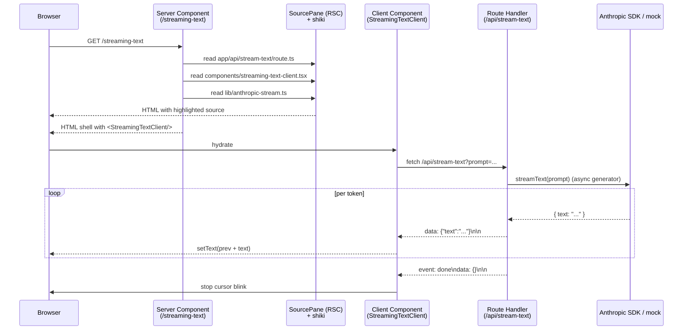

# Architecture

The repo is one Next.js 15 App Router app at the repo root, with one
page per pattern under `app/<slug>/` (D-002 — one project, one page
per pattern; keeps the demos linkable as standalone references and
the per-pattern footprint shallow). Each page is self-contained: it
imports its own components from `components/`, its own helpers from
`lib/`, and reads its own source files from disk for the side-by-side
display.

```
nextjs-streaming-ai-patterns/
├── app/
│   ├── layout.tsx
│   ├── globals.css
│   ├── page.tsx                     ← hub page (PATTERNS array)
│   ├── streaming-text/page.tsx      ← pattern #1
│   ├── tool-use/page.tsx            ← pattern #2
│   ├── partial-json/page.tsx        ← pattern #3
│   ├── optimistic-rollback/page.tsx ← pattern #4
│   ├── error-recovery/page.tsx      ← pattern #5
│   └── api/
│       ├── stream-text/route.ts     ← SSE endpoint for streaming-text
│       ├── tool-use/route.ts        ← SSE endpoint for tool-use
│       ├── partial-json/route.ts    ← SSE endpoint for partial-json
│       ├── optimistic/route.ts      ← decision endpoint for optimistic-rollback
│       └── error-recovery/route.ts  ← checkpoint-bearing SSE for error-recovery
├── components/
│   ├── source-pane.tsx                ← Server Component (fs read + shiki)
│   ├── streaming-text-client.tsx      ← Client Component for /streaming-text
│   ├── tool-use-client.tsx            ← Client Component for /tool-use
│   ├── partial-json-client.tsx        ← Client Component for /partial-json
│   ├── optimistic-rollback-client.tsx ← Client Component for /optimistic-rollback
│   └── error-recovery-client.tsx      ← Client Component for /error-recovery
├── lib/
│   ├── anthropic-stream.ts          ← live ↔ mock mode switch (D-003)
│   ├── mock-stream.ts                ← deterministic text streamer
│   ├── mock-tool-stream.ts           ← deterministic tool-use frames
│   ├── mock-json-stream.ts           ← deterministic partial-JSON token stream
│   ├── partial-json.ts               ← incremental JSON parser (D-008)
│   ├── optimistic-decision.ts        ← deterministic 50/50 oracle (D-010)
│   ├── checkpoint-stream.ts          ← checkpoint protocol (D-011)
│   └── shiki.ts                      ← syntax-highlighter singleton
├── scripts/
│   └── capture_demo.ts               ← Playwright demo tour (D-012)
├── test/
│   └── *.test.ts                     ← hermetic vitest suite (one file per pattern + helpers)
└── docs/
    └── architecture.md               ← you are here
```

## The streaming-text request flow



## Why a route handler instead of pure RSC streaming

React 19 + Next 15 do *not* provide a stable zero-JS pattern for
per-token-in-the-browser streaming text from a Server Component. Server
Components can stream their JSX progressively via `<Suspense>` boundaries,
but each boundary resolves once with its full content — there's no public
API for a Server Component to yield a partial string and re-render in-place
on the client without client JS.

The honest answer is therefore: server-side streaming happens in the route
handler (yielding tokens into the HTTP response body), and browser-side
incremental rendering happens in a Client Component that reads the
ReadableStream. Both pieces are required for the end-to-end pattern.

The shape of `/api/stream-text` (SSE format, `data: {json}\n\n` framing)
is the canonical Next 15 streaming endpoint. The Client Component is
~100 lines and self-contained — no `ai` SDK dependency.

## The no-key fallback (D-003)

`lib/anthropic-stream.ts` exports `streamText(prompt)`. If
`ANTHROPIC_API_KEY` is set, it calls `Anthropic.messages.stream(...)`
and yields `text_delta` events. If unset, it yields from
`lib/mock-stream.ts`'s deterministic fixture with realistic per-token
jitter (skipped when seeded for tests).

Both branches yield the same `{ text: string }` shape, so the route
handler never branches on mode. The page footer surfaces which mode
is active so the operator isn't confused about whether the demo is
"real."

## The source-pane invariant (D-004)

`components/source-pane.tsx` is a Server Component that reads source
files from disk at request time and syntax-highlights them with shiki.
The page declares which files to display; the pane reads them. There
is no copy-paste of code into JSX strings — the displayed source is
always literally the file on disk.

This means a code change anywhere in the imported file (route handler,
client component, helper) is immediately reflected in the displayed
source on next request. Drift is impossible by construction.

## Shipped patterns

All five patterns ship today. The streaming-text request flow above is
the canonical end-to-end shape; each subsequent pattern adds one
distinct mechanism on top of the same SSE envelope (D-005, D-006).

- **`app/streaming-text/`** (#1) — the foundational shape. Route
  handler yields `data: {text}\n\n` frames; client reads via
  `ReadableStream` and progressively renders. Everything below is
  incremental work on this skeleton.
- **`app/tool-use/`** (#2) — same SSE envelope with additional
  `tool_use_*` event kinds. The client renders the tool call, the
  streaming JSON arguments, the result, and the resumed reasoning. A
  visible Interrupt button calls `abort()` on the fetch and produces
  a clean transcript ending in `message_stop: interrupted` (D-007).
- **`app/partial-json/`** (#3) — progressive rendering of a structured
  response as the model emits it. A dep-free in-repo state machine
  (`lib/partial-json.ts`, D-008) tolerates open strings, open
  arrays/objects, trailing commas, and mid-token primitives, and
  exposes a `committedAny` flag so UI fields fade in as their slot
  first contains a value.
- **`app/optimistic-rollback/`** (#4) — React 19 `useOptimistic` + a
  deterministic 50/50 decision oracle keyed by `(id, click_count)` on
  the server (`lib/optimistic-decision.ts`, D-010). Successes commit;
  failures roll back with a rendered reason and a border-flash
  animation. The rollback path is reproducible by construction.
- **`app/error-recovery/`** (#5) — checkpoint protocol layered over
  SSE (`lib/checkpoint-stream.ts`, D-011). The route handler emits a
  `kind: "checkpoint"` event every few tokens; the client records the
  most recent checkpoint; on a deliberate drop the client reconnects
  with `?since=N` and accumulating text never resets. Checkpoints are
  token-position integers, so the server keeps no per-session state.

A captured Playwright demo tour driving all five pages is in
`scripts/capture_demo.ts` (D-012); the binary commit is the
operationally-gated follow-on tracked in issue #16.
