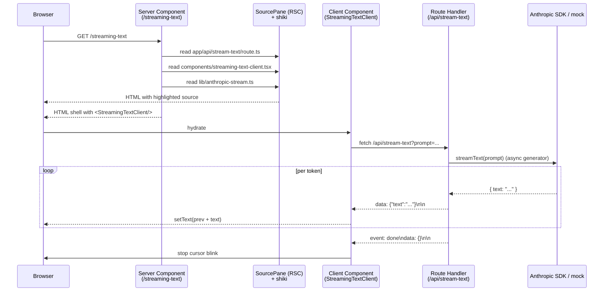

# Architecture

The repo is one Next.js 15 App Router app, with one page per pattern under
`app/<slug>/`. Each page is self-contained: it imports its own components
from `components/`, its own helpers from `lib/`, and reads its own source
files from disk for the side-by-side display.

```
nextjs-streaming-ai-patterns/
├── app/
│   ├── layout.tsx
│   ├── globals.css
│   ├── page.tsx                     ← hub page (lists patterns)
│   ├── streaming-text/
│   │   └── page.tsx                 ← shipped (issue #1)
│   └── api/
│       └── stream-text/
│           └── route.ts             ← SSE endpoint for streaming-text
├── components/
│   ├── streaming-text-client.tsx    ← Client Component (SSE reader)
│   └── source-pane.tsx              ← Server Component (fs read + shiki)
├── lib/
│   ├── anthropic-stream.ts          ← live ↔ mock mode switch
│   ├── mock-stream.ts               ← deterministic fallback streamer
│   └── shiki.ts                     ← syntax-highlighter singleton
├── test/
│   └── mock-stream.test.ts          ← 7 hermetic tests (vitest)
└── docs/
    └── architecture.md              ← you are here
```

## The streaming-text request flow



## Why a route handler instead of pure RSC streaming

React 19 + Next 15 do *not* provide a stable zero-JS pattern for
per-token-in-the-browser streaming text from a Server Component. Server
Components can stream their JSX progressively via `<Suspense>` boundaries,
but each boundary resolves once with its full content — there's no public
API for a Server Component to yield a partial string and re-render in-place
on the client without client JS.

The honest answer is therefore: server-side streaming happens in the route
handler (yielding tokens into the HTTP response body), and browser-side
incremental rendering happens in a Client Component that reads the
ReadableStream. Both pieces are required for the end-to-end pattern.

The shape of `/api/stream-text` (SSE format, `data: {json}\n\n` framing)
is the canonical Next 15 streaming endpoint. The Client Component is
~100 lines and self-contained — no `ai` SDK dependency.

## The no-key fallback (D-003)

`lib/anthropic-stream.ts` exports `streamText(prompt)`. If
`ANTHROPIC_API_KEY` is set, it calls `Anthropic.messages.stream(...)`
and yields `text_delta` events. If unset, it yields from
`lib/mock-stream.ts`'s deterministic fixture with realistic per-token
jitter (skipped when seeded for tests).

Both branches yield the same `{ text: string }` shape, so the route
handler never branches on mode. The page footer surfaces which mode
is active so the operator isn't confused about whether the demo is
"real."

## The source-pane invariant (D-004)

`components/source-pane.tsx` is a Server Component that reads source
files from disk at request time and syntax-highlights them with shiki.
The page declares which files to display; the pane reads them. There
is no copy-paste of code into JSX strings — the displayed source is
always literally the file on disk.

This means a code change anywhere in the imported file (route handler,
client component, helper) is immediately reflected in the displayed
source on next request. Drift is impossible by construction.

## Pending patterns (open / to-be-filed issues)

- **#2** — Tool-use UI with visible reasoning + interruption. Same SSE
  primitive, but the per-event payload also carries tool-call frames
  (`event: tool_use\ndata: {...}`); the Client Component renders a
  timeline view and exposes an Abort button.
- *(unfiled)* — Partial JSON parsing. Stream is JSON-typed; client
  uses an incremental parser to reveal fields as they complete.
- *(unfiled)* — Optimistic updates with rollback. The UI assumes the
  next state immediately, then reconciles when the stream contradicts.
- *(unfiled)* — Error recovery mid-stream. Server sends `event: error`,
  client retries from last token offset.
